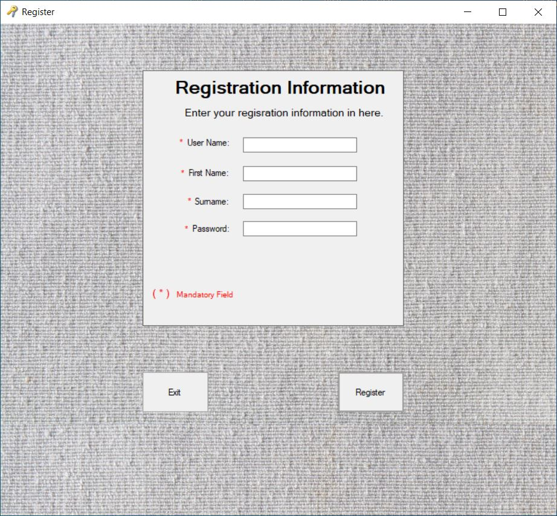

<h1>C# Time Management and Reporting Tool</h1>

 A time management and reporting tool for personal use. This application fulfills the following functional and non-functional requirements,
   
<h3>R1. The Software shall allow user to register himself/herself when using the application for the
first time.</h3>
<h4>R1.1. The software allowed to register one time as it is for personal use only.</h4>
 <h5>R1.1.1. That mean already registered user in this application cannot re-register himself/ herself.</h5>
<h4>R1.2. The software will mark registered person as a user of this application.</h4>
<h4>R1.3. The software register functionality will be removed once user has registered himself/herself.</h4>
<h4>R1.4. The software will provide a form for the user to register.</h4>
 <h5>R1.4.1. It is mandatory to user must enter name, username and password for the registration
submission himself/ herself to the application.</h5>
<h3>R2. The Software shall allow user to login to the application using his/her credentials.</h3>
<h4>R2.1. The software will provide a form for the user to login.</h4>
<h4>R2.2. This software should allow user to access and login to the application using his/her valid
credentials (username, password).</h4>
<h3>R2.3. This software should reject user from access and login to the application, if his/her credentials
(username, password) are invalid.</h3>
<h3>R3. The Software shall allow user to logout or exit from the application whenever he/she wants
and automatically logout from the application if not using application for several minutes.</h3>
<h4>R3.1. The application should allow user to access and login to the application whenever he/she wants
and as many as possible.</h4>
<h4>R3.2. The software will automatically logout user from application if it not using for few minutes.</h4>
<h4>R3.3. The software will provide form to the login to the application if user automatically logged out
from the application or close the application without logging out from the application.</h4>
<h3>R4. The Software shall allow to manage event, task, appointment and contact details in the
system.</h3>
<h4>R4.1. The Software will provide a separate form for add event, add task, add appointment and add
contact.</h4>
<h4>R4.2. The software will save newly added event, task, appointment and contact.</h4>
<h4>R4.3. The software should have user to enter name, date and time, contacts list, description and
available category(one off or recurring-daily, monthly, daily or yearly) as a compulsory information</h4>
<h4>R4.4. The software should have user to enter sign of respect, name, sur name, contact number and
email as a compulsory information and occupation as an optional information in the contact form.</h4>
<h4>R4.5. The Software will provide form for update selected event, update selected task, update selected
appointment and update selected contact.</h4>
<h4>R4.6. The software will save newly updated event, task, appointment and contact.</h4>
<h4>R4.7. The software should have user to update name, date and time, contacts list, description and
available category(one off or recurring-daily, monthly, daily or yearly) as a compulsory information
and must able to update additional notes, address, location and priority level as an optional
information in event, task and appointment forms.</h4>
<h4>R4.8. The software should have user to update sign of respect, name, sur name, contact number and
email as a compulsory information and occupation as an optional information in contact form.</h4>
<h4>R4.9. The software should have user to delete selected event, task, appointment or contact from the
application.</h4>
 <h5>R4.9.1. The software should not allow to delete contact once it is assigned to event or
appointment until unassign it from event or appointment.</h5>
<h3>R5. The Software shall allow user to view available content in the system.</h3>
<h4>R5.1. The software should have available content to view in a table as a compulsory viewable area.</h4>
<h3>R6. The Software shall allow user to download filtered general report for according to available
contents in the system.</h3>
<h4>R6.1. The software should allow to download a rich report according to the filtered by duration type
with report type.</h4>
<h4>R6.2. Downloaded file should contain available data in the system and file downloaded date.</h4>
<h3>R7. The Software shall allow user to predict time usage for selected date or month.</h3>
<h3>R8.1. The software should have user to view his/her predicted time usage for selected date or month
for future in prediction screen.</h3>
<h3>R9. The Software shall have an audit functionality.</h3>
<h4>R9.1 The software should able to record user changes in the application.</h4>
  
  Non-Functional Requirement
<h3>NF1. Application will run on windows system.</h3>
<h3>NF2. Application will be created using only on C# and windows forms using visual studio.</h3>
<h3>NF3. Password secured by encrypting password.</h3>
<h3>NF4. Data created by application will be stored on SQL server databases.</h3>
<h3>NF5. Reliability, Performance and Consistency will depend on application process with SQL server
databases.</h3>
<h3>NF6. Application will be developed to extend its scalability.</h3>
<h3>NF7. Load time should only limit to be less than 5 seconds.</h3>

<h2>Configuration Steps</h2>

<ol>
  <li>Open Visual Studio</li>
  <li>Select "File" from the top toolbar</li>
  <li>Navigate to "New", then "Project from existing code"</li>
  
 In the import configuration window, 
 <li>Set project type as C#</li>
 <li>Select source code - find and select the file called "src"</li>
 <li>Finally, select "Finish" to import the project</li>
</ol>

<h2>Screenshots of application</h2>

<figure>
  
 <figcaption>figure 1. Login</figcaption>
   
</figure>

<figure>
 
 
 <figcaption>figure 2. Register</figcaption>
  
</figure>

<figure>
 

 <figcaption>figure 3. Contact Mgt</figcaption>
  
</figure>

<figure>
 

 <figcaption>figure 4. Event Mgt</figcaption>
  
</figure>

<figure>
 
 
 <figcaption>figure 5. Appointment Mgt</figcaption>
  
</figure>

<figure>
 
 
 <figcaption>figure 6. Task Mgt</figcaption>
  
</figure>

<figure>
 
 
 <figcaption>figure 7. Time Usage and Predict</figcaption>
  
</figure>

<figure>
 
 
 <figcaption>figure 8. Report</figcaption>
  
</figure>

<figure>
 

 <figcaption>figure 9. Audit Trace</figcaption>
  
</figure>

